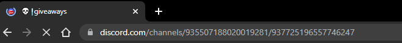

# AutoReactDiscord
This script auto reacts :tada: emoji to last 3 messages in each channel discord url. 

Reacts to `messageAuthor` with `["giveaway"]` included.

Exclude react when `botTag` is not found and when `messageContent` has `["grat","congratulation","ended"]` in the text

Things to note:
- slow internet might cause script to not work well.
- after every loop completed, wait for 60sec to restart loop

### Software :computer:

- Python 3.6+
- [pip](https://pip.pypa.io/en/stable/) package installer
- Python [virtual environment](https://virtualenv.pypa.io/en/latest/)
- ~~[chromedriver](https://chromedriver.chromium.org/downloads) based off your OS & Chrome version~~

### File configuration 

- Rename `config.json.example` to `config.json` and add/update the information accordingly.
- Get discord giveaway channel url by accessing discord from your browser.

## Setup & Run 

This project is tested and developed on Window. You can probably get this up and running on Linux or Mac with some minor tweaks.

1. Change the `chromedriver-binary==99.0.4844.51.0` version in `requirements.txt` according to your chrome version
	- Chrome top right three dot > Help > About Google Chrome, you will find your chrome version there.

2. Run `./setup.sh` 

3. Run `py main.py` or `py main.py --bg` to run in background without browser showing

## Disclaimer

> THIS SOFTWARE IS PROVIDED BY THE COPYRIGHT HOLDERS AND CONTRIBUTORS "AS IS" AND ANY EXPRESS OR IMPLIED WARRANTIES, INCLUDING, BUT NOT LIMITED TO, THE IMPLIED WARRANTIES OF MERCHANTABILITY AND FITNESS FOR A PARTICULAR PURPOSE ARE DISCLAIMED. IN NO EVENT SHALL THE COPYRIGHT OWNER OR CONTRIBUTORS BE LIABLE FOR ANY DIRECT, INDIRECT, INCIDENTAL, SPECIAL, EXEMPLARY, OR CONSEQUENTIAL DAMAGES (INCLUDING, BUT NOT LIMITED TO, PROCUREMENT OF SUBSTITUTE GOODS OR SERVICES; LOSS OF USE, DATA, OR PROFITS; OR BUSINESS INTERRUPTION) HOWEVER CAUSED AND ON ANY THEORY OF LIABILITY, WHETHER IN CONTRACT, STRICT LIABILITY, OR TORT (INCLUDING NEGLIGENCE OR OTHERWISE) ARISING IN ANY WAY OUT OF THE USE OF THIS SOFTWARE, EVEN IF ADVISED OF THE POSSIBILITY OF SUCH DAMAGE.

-   This software comes with no warranties of any kind whatsoever, and may not be useful for anything. Use it at your own risk!
-   This software was designed to be used only for research purposes.
-   Uses are not recommended and have never been evaluated.
-   If these terms are not acceptable, you aren't allowed to use the code.

---
